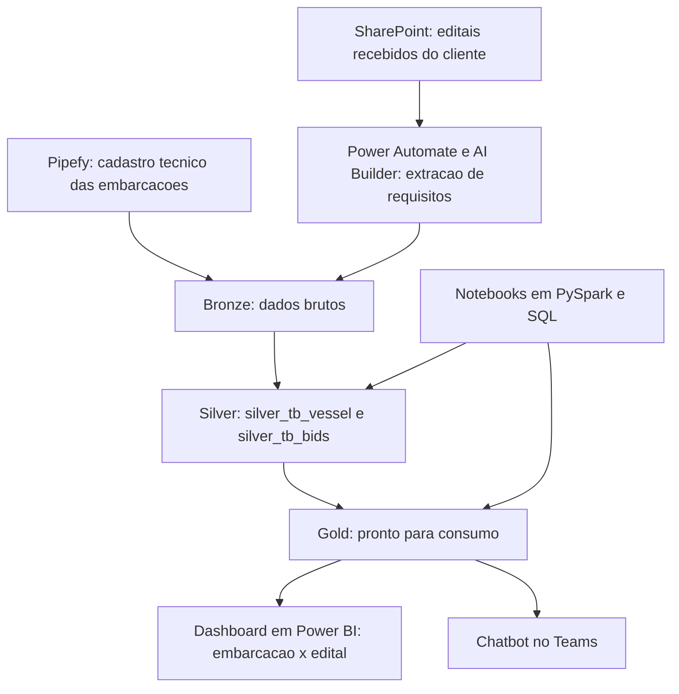

# Data Lakehouse em Microsoft Fabric: a primeira arquitetura de dados da companhia

Estudo de caso da implantação do primeiro data lakehouse de uma empresa do setor de navegação offshore, entre março de 2024 e abril de 2025.

**Autora:** Isabela Felix, Analista Sênior de Dados e Automação de Processos, 7 anos de atuação corporativa.
Portfólio: [isabela-felix.github.io](https://isabela-felix.github.io)
GitHub: [github.com/Isabela-Felix](https://github.com/Isabela-Felix)

---

## Contexto e problema

A companhia não tinha área de dados. No dia da minha promoção para analista de dados, recebi a missão de implantar um data lake corporativo do zero.

O piloto escolhido foi a área de engenharia, que tinha um gargalo real: a cada edital recebido do cliente, a análise de quais embarcações da frota poderiam concorrer, qual delas mais se aproximava das exigências e o que faltava para atender era feita manualmente, documento por documento.

## Solução desenhada

O objetivo foi estruturar a primeira arquitetura de dados da companhia e provar valor com um caso de negócio concreto: cruzar automaticamente os requisitos técnicos dos editais com os dados técnicos da frota.

A condução seguiu quatro etapas:

- **Requisitos antes de fornecedor:** escrevi o documento de requisitos técnicos e funcionais que suprimentos usou para receber propostas de fornecedores, conduzindo essa etapa junto ao meu gerente.
- **Soft selection:** comparei as alternativas de mercado considerando o ambiente já existente na companhia, todo baseado em Microsoft.
- **Escolha do Microsoft Fabric:** a plataforma ainda era embrionária na época, o que exigiu estudo do modelo de SKU e da capacidade contratada.
- **Custo como critério:** analisei como a migração poderia reduzir o custo de licenciamento do Power BI, transformando a decisão técnica também em argumento financeiro.

## Arquitetura

Duas fontes alimentam o lakehouse. O cadastro técnico das embarcações é feito no Pipefy, com validações diretamente no formulário. Os editais são carregados no SharePoint e lidos por Power Automate com AI Builder, que extrai os requisitos técnicos. Os dados percorrem as camadas Bronze, Silver e Gold no OneLake, e as tabelas da camada Silver foram modeladas para permitir o cruzamento direto entre requisitos do edital e atributos técnicos da frota.

## Ferramentas

- **Microsoft Fabric e OneLake:** plataforma central do lakehouse, com as camadas Bronze, Silver e Gold.
- **PySpark e SQL:** notebooks de tratamento e construção das tabelas.
- **Pipefy:** entrada padronizada dos dados técnicos das embarcações.
- **Power Automate, AI Builder e SharePoint:** leitura dos editais e extração dos requisitos.
- **Power BI:** dashboard de comparação entre embarcações e editais.

## Meu papel

Liderei o projeto: levantamento de requisitos, seleção da ferramenta e gestão das consultorias envolvidas. Havia consultoria para todas as frentes, e ainda assim coloquei a mão em cada uma delas para direcionar as decisões e aprender. Construí parte das tabelas do lakehouse em PySpark e SQL dentro do Fabric, e acompanhei a configuração do Pipefy e da esteira de leitura dos editais.

## Resultados

- O data lakehouse foi entregue com as camadas Bronze, Silver e Gold estruturadas no OneLake.
- A área de engenharia passou a comparar uma embarcação com os requisitos de um edital de forma intuitiva, em um dashboard conectado diretamente às tabelas.
- A companhia passou a ter uma base de dados corporativa própria, que se tornou fundação para os projetos de dados seguintes.

## Aprendizados

O principal aprendizado foi sobre foco de escopo. Ao longo do projeto, a atenção migrou do data lake para a camada de inteligência artificial, e a entrega de IA frustrou a expectativa da área de negócio, o que acabou ofuscando um resultado de infraestrutura que tinha sido bem-sucedido. O projeto seguiu depois com outra consultoria e a IA foi reimplementada em Python.

Fundação e vitrine são entregas diferentes. Hoje eu trataria a IA como uma fase separada, com escopo, expectativa e critério de aceite acordados com o negócio antes do início, para que ela não comprometa a percepção de valor da fundação de dados que a sustenta.

---

*Cliente e dados reais anonimizados neste estudo de caso. Processo, arquitetura e resultados são reais.*
