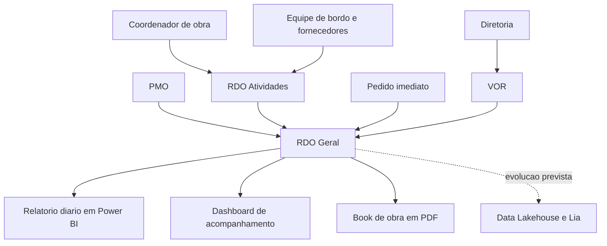

# Gestão de Obras Offshore: do WhatsApp ao relatório diário para a diretoria

Estudo de caso da implantação do Pipefy em uma empresa do setor de navegação offshore, tendo a área de PMO como piloto da ferramenta na companhia.

**Autora:** Isabela Felix, Analista Sênior de Dados e Automação de Processos, 7 anos de atuação corporativa.
Portfólio: [isabela-felix.github.io](https://isabela-felix.github.io)
GitHub: [github.com/Isabela-Felix](https://github.com/Isabela-Felix)

---

## Contexto e problema

A área de PMO cuida dos projetos de obra das embarcações, e a companhia opera 45 navios. O acompanhamento dessas obras acontecia por WhatsApp, ligação e planilhas soltas: não havia registro estruturado de progresso, de impedimento nem de custo por atividade.

A própria área identificou que estava perdendo milhões por falta de organização da obra, com dois problemas recorrentes: escopo mal definido e material indisponível no início dos trabalhos. A partir desse diagnóstico nasceu a decisão de migrar o processo para o Pipefy, usando o PMO como piloto da ferramenta na companhia.

Uma primeira versão da solução havia sido construída por outro analista. Assumi o projeto, remapeei o processo junto ao negócio e refiz a solução, porque a estrutura anterior não sustentava a operação real da área.

## Solução desenhada

A solução ficou organizada em quatro fluxos conectados no Pipefy, cada um resolvendo uma dor específica do processo de obra:

- **RDO Atividades:** orquestra cada atividade da obra, registrando progresso, impedimento, caminho crítico, disciplina, fornecedor e valores planejados.
- **RDO Geral:** consolida as informações da obra e gera o PDF final do book.
- **Pedido imediato:** trata a compra de materiais de baixo valor, que antes era resolvida caso a caso.
- **VOR:** leva à diretoria a aprovação de escopo não orçado, com valor e justificativa registrados.

Sobre esses fluxos foram construídas as saídas que o negócio consome: o relatório diário em Power BI enviado à diretoria, o dashboard consolidado de acompanhamento das obras e o book de obra gerado automaticamente ao final de cada projeto.

## Arquitetura

O RDO Geral funciona como ponto de consolidação: recebe as atividades, os pedidos de material e as aprovações de escopo adicional, e alimenta as três saídas que chegam ao negócio. A conexão com o Data Lakehouse em Microsoft Fabric e com a automação financeira (projeto Lia), para pagamento dos custos da obra, estava prevista como próximo passo do projeto.

## Ferramentas

- **Pipefy:** orquestração dos quatro fluxos de obra.
- **Power BI:** relatório diário para a diretoria e dashboard de acompanhamento.
- **Activepieces e Workato:** integrações entre os fluxos e geração automática do book.
- **Draw.IO:** desenho dos fluxos campo a campo, validados com a área antes da construção.
- **Excel:** apoio na estruturação e conferência dos dados durante o mapeamento.

## Meu papel

Atuei como líder técnica do projeto. Conduzi o mapeamento do processo junto ao PMO e às demais áreas envolvidas, desenvolvi os pipes de RDO e construí os dashboards e o relatório diário. Liderei um time de 3 pessoas, que me apoiou nas integrações e nos demais fluxos.

Cada fluxo foi desenhado campo a campo em Draw.IO e validado com a área antes de ir para a ferramenta, usando uma legenda por tipo de campo do Pipefy para que a própria área conseguisse revisar o desenho sem depender de vocabulário técnico.

## Resultados

- A diretoria passou a receber diariamente, por obra em aberto, um relatório com avanço planejado contra realizado, atividades por disciplina, criticidade e marcos contratuais, no lugar do acompanhamento informal por mensagem.
- O PMO e os coordenadores ganharam um dashboard de acompanhamento para o dia a dia, com filtro por obra e drill-through até o nível da atividade. Os indicadores foram escolhidos junto com a área para responder as perguntas que ela já fazia todos os dias: quanto da obra foi concluído e quanto do prazo já foi consumido, desde quando o realizado descolou do planejado, qual disciplina está travando a frente, o que é requisito de classe ou contratual contra o que é oportunidade de melhoria, qual a dependência de terceiros e como estão os marcos contratuais. O painel também guarda o comentário crítico do dia, preservando um histórico que antes se perdia em conversas de WhatsApp.
- Ao final de cada obra, o book passou a ser gerado automaticamente, com resumo executivo, relatório final, Gantt e uma página por atividade. Um exemplo real do book gerado tem 262 páginas.
- O processo passou a ter registro, histórico e rastreabilidade por atividade.

## Aprendizados

O maior desafio não foi técnico, foi de adoção. A operação estava acostumada a resolver tudo por WhatsApp e ligação, e registrar a informação em um sistema representava mudança real de rotina. Isso reforçou algo que levo para todos os projetos: conversar com a área na linguagem dela e mostrar o ganho no dia a dia de quem preenche, não só o ganho do gestor que consome o relatório.

Outro aprendizado veio do resumo de obra. A primeira versão usava IA para gerar o texto enviado aos coordenadores, mas a versão baseada em regras apresentou menos erros e acabou substituindo a anterior. Nem toda etapa ganha com IA, e reconhecer isso cedo evitou retrabalho.

---

*Cliente e dados reais anonimizados neste estudo de caso. Processo, arquitetura e resultados são reais.*
