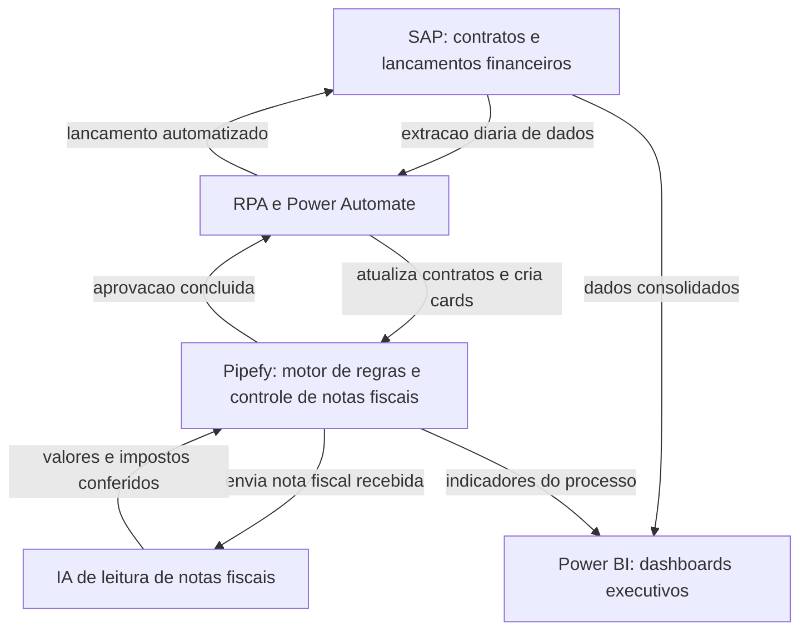

# Lia: Automação Financeira Integrada ao SAP

Estudo de caso de um projeto de automação de processos financeiros, desenvolvido para uma empresa do setor de navegação offshore, entre março de 2024 e setembro de 2025.

**Autora:** Isabela Felix, Analista Sênior de Dados e Automação de Processos, 7 anos de atuação corporativa.
Portfólio: [isabela-felix.github.io](https://isabela-felix.github.io)
GitHub: [github.com/Isabela-Felix](https://github.com/Isabela-Felix)

---

## Contexto e problema

A empresa processava seus lançamentos financeiros no SAP de forma manual: orçamento, lançamentos de pagamento e a análise de Real x Orçado de CAPEX e OPEX dependiam de conferência humana em cada etapa. Isso trazia dois problemas centrais: alto esforço manual repetido em múltiplas áreas e baixa rastreabilidade dos lançamentos, já que as informações ficavam dispersas entre o SAP, planilhas e e-mails.

O projeto Lia nasceu para resolver isso, automatizando o fluxo financeiro de ponta a ponta e dando visibilidade consolidada do processo para a gestão.

## Solução desenhada

A solução mapeou os requisitos funcionais e técnicos do processo financeiro (orçamento, lançamentos de pagamento no SAP e análise de Real x Orçado de CAPEX e OPEX) e desenhou uma arquitetura que integra automação de sistema (RPA e Power Automate), orquestração de fluxo (Pipefy) e inteligência artificial aplicada à leitura de documentos.

Principais entregas:

- Mapeamento de requisitos funcionais e técnicos do processo financeiro.
- Desenho de arquitetura técnica e funcional da automação.
- Criação do controle de notas fiscais no Pipefy.
- Automação de lançamentos financeiros via Power Automate, integrado ao SAP e ao Pipefy.
- RPA para lançamentos diretamente no SAP.
- IA aplicada à leitura e conferência de notas fiscais.
- Relatório de indicadores financeiros em Power BI, cruzando orçamento, sistema integrado e lançamentos SAP, com visão consolidada de todos os custos da empresa.
- Dois dashboards executivos de acompanhamento.
- Criação de um avatar (Lia) como material de apoio ao projeto, usado em treinamentos e comunicação com as áreas.
- Gerenciamento do projeto de ponta a ponta para implementação em mais de 20 áreas da empresa.

## Arquitetura

O fluxo conecta quatro camadas: o SAP como sistema de origem e destino dos lançamentos, a automação via RPA e Power Automate como ponte entre sistemas, o Pipefy como motor de regras e controle de notas fiscais, e o Power BI como camada de visibilidade executiva.

Na prática: o RPA acessa o SAP diariamente para extrair e atualizar informações de contratos, o que alimenta o Pipefy com cards já estruturados. Notas fiscais recebidas no Pipefy passam pela camada de IA, que confere valores e impostos antes de liberar a aprovação. Uma vez aprovado, o Power Automate realiza o lançamento automatizado de volta no SAP. O Power BI consolida dados do SAP e do Pipefy nos dashboards executivos e no relatório de indicadores.

## Ferramentas

- **SAP:** sistema de origem dos contratos e destino dos lançamentos financeiros.
- **Pipefy:** motor de regras de negócio e controle de notas fiscais.
- **Power Automate:** automação de lançamentos, integrando SAP e Pipefy.
- **RPA:** automação de lançamentos diretamente na interface do SAP.
- **IA:** leitura e conferência de notas fiscais.
- **Power BI:** relatório de indicadores financeiros e dashboards executivos.

## Meu papel

Atuei como Líder técnica e Analista de Dados do projeto, entre março de 2024 e setembro de 2025. Fui responsável pelo mapeamento de requisitos, desenho da arquitetura técnica e funcional, construção do controle de notas fiscais no Pipefy, automação dos lançamentos financeiros, criação dos dashboards e do relatório em Power BI, além do gerenciamento do projeto de ponta a ponta para a implementação em mais de 20 áreas da empresa.

## Resultados

A automação trouxe redução de esforço manual nos lançamentos financeiros e aumento de rastreabilidade do processo, com visibilidade consolidada de orçamento, lançamentos e custos para a gestão.

---

*Cliente e dados reais anonimizados neste estudo de caso. Processo, arquitetura e resultados são reais.*
