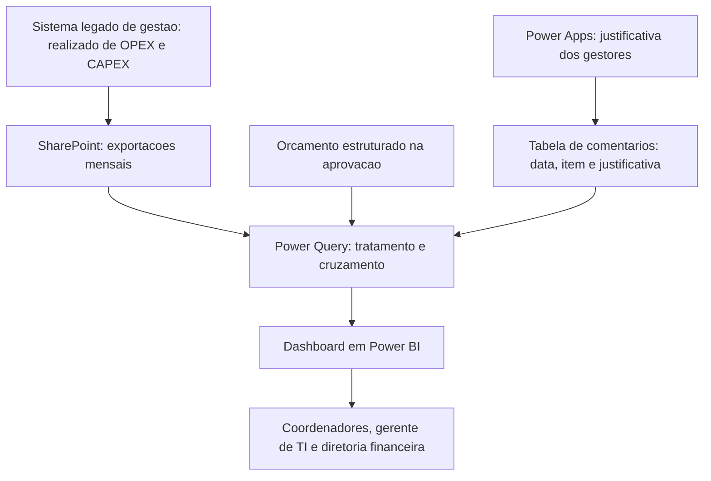

# Real x Orçado: de dois dias para quatro horas

Estudo de caso da análise mensal de Real x Orçado de OPEX e CAPEX da área de TI de uma empresa do setor de navegação offshore, construída e evoluída entre 2021 e 2025. É o projeto mais antigo do meu portfólio, e o ponto em que minha trajetória em dados começou.

**Autora:** Isabela Felix, Analista Sênior de Dados e Automação de Processos, 7 anos de atuação corporativa.
Portfólio: [isabela-felix.github.io](https://isabela-felix.github.io)
GitHub: [github.com/Isabela-Felix](https://github.com/Isabela-Felix)

---

## Contexto e problema

Todo mês, a análise de Real x Orçado de OPEX e CAPEX da área de TI era montada à mão. Os dados vinham do sistema legado de gestão, que não permitia conexão direta, e eram cruzados com o orçamento, que era todo feito em Excel e não era registrado no ERP.

Como o orçamento era escrito sem padrão, cada linha do realizado precisava ser classificada manualmente em uma tabela dinâmica antes de identificar os dez maiores desvios. O processo levava dois dias e se repetia do zero no mês seguinte. A apresentação de resultados era uma tabela dinâmica com comentários.

## Solução desenhada

Nos primeiros meses fiz o processo exatamente como me ensinaram, para entender cada etapa antes de mudar qualquer coisa. A partir daí, a evolução aconteceu em camadas:

- **Excel:** otimizei a planilha de controle de pagamentos e a de análise, com fórmulas e divisão das bases, e criei um primeiro painel dentro do próprio Excel para a apresentação de resultados.
- **Power BI:** com o incentivo do meu gestor, fiz um intensivo e construí meu primeiro dashboard.
- **Padronização na origem:** assumi a gestão do orçamento e passei a escrevê-lo de forma estruturada no momento da aprovação, para que cada lançamento do realizado se ligasse a uma linha orçamentária sem esforço manual.
- **Comentários dos gestores:** criei uma tabela com data, item orçamentário e justificativa, alimentada pelos próprios gestores por meio de um Power Apps.

## Arquitetura

Como o sistema legado não permitia conexão direta, os dados passaram a ser exportados para uma pasta no SharePoint e consumidos pelo Power Query. O orçamento, agora estruturado, se liga ao realizado pela linha orçamentária, e a tabela de comentários adiciona a justificativa de cada desvio ao painel.

## O dashboard

- **Visão geral:** orçado, realizado, forecast e EAC (realizado mais o que ainda falta realizar no ano), com evolução mês a mês e acumulada.
- **Farol de metas por alocação:** OPEX Mar, OPEX Terra, SG&A, CAPEX e despesa de estaleiro, com a justificativa do mês.
- **Top 10 fornecedores de OPEX:** mês, acumulado do ano e projeção de fechamento.
- **Top 10 escopos de CAPEX:** com o comentário de cada desvio relevante.
- **Detalhamentos:** por item orçamentário e por lançamento, para quem precisa descer ao nível da linha.

## Ferramentas

- **Excel:** primeira versão da análise e do painel.
- **Power BI e Power Query:** modelagem, tratamento e visualização.
- **SharePoint:** repositório das exportações do sistema legado.
- **Power Apps:** registro das justificativas pelos gestores.
- **ERP (SAP):** requisições e lançamentos que dão origem ao realizado.

## Meu papel

Fui responsável pela análise de ponta a ponta: criei e evoluí o processo, construí o dashboard, assumi a gestão do orçamento de TI e estruturei a forma de registrar as justificativas dos desvios.

## Resultados

- A análise mensal caiu de dois dias para quatro horas.
- O dashboard passou a ser usado por todos os coordenadores e pelo gerente de TI para acompanhar os próprios custos.
- As telas foram desenhadas para responder às perguntas do diretor financeiro, a quem a TI se reportava.
- A apresentação de resultados virou referência na companhia pela praticidade.
- O histórico de justificativas deixou de se perder de um mês para o outro, e o tempo liberado foi para tarefas mais estratégicas.

## Aprendizados

O dashboard só ficou simples porque o dado ficou simples antes. Padronizar a forma como o orçamento era escrito resolveu o problema na origem e eliminou a classificação manual, algo que nenhuma fórmula ou visual resolveria sozinho.

O mesmo vale para os comentários: quando quem conhece o custo registra a justificativa, a análise ganha contexto e deixa de depender de uma pessoa. Foi aqui que aprendi o raciocínio que levei para todos os projetos seguintes.

---

*Cliente anonimizado. Os dados exibidos no dashboard de demonstração são 100% fictícios, reconstruídos com a mesma estrutura do modelo original. O processo e o desenho do painel são reais.*
